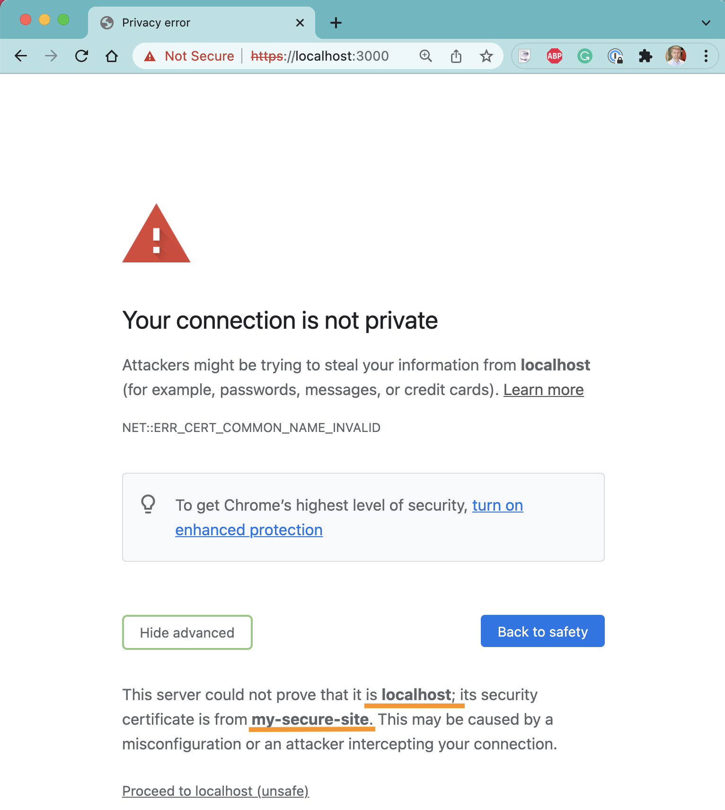
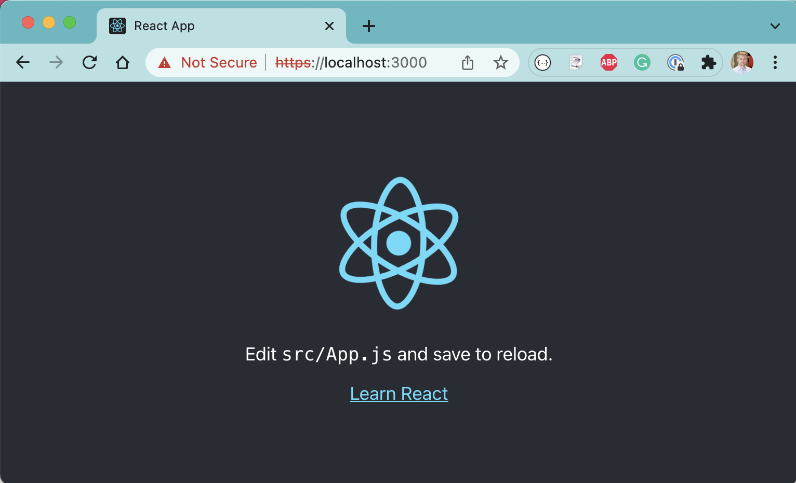
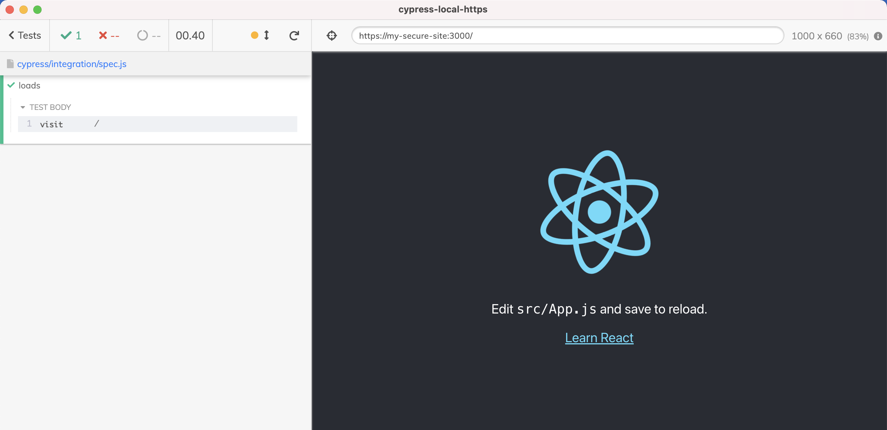

# cypress-local-https

> Example using Cypress to test Create-React-App site running with custom certificate for domain "my-secure-site"

## Making certificate

Before testing the site, we need to make local self-signed certificate in the folder ".cert". On Mac I used the following commands to create a self-signed certificate for domain "my-secure-site"

```
$ brew install mkcert
$ mkcert -install
$ mkdir .cert
$ mkcert -key-file ./.cert/key.pem -cert-file ./.cert/cert.pem "my-secure-site"
```

You should now have two text files in the folder `.cert`: `cert.pem` and `key.pem`

## Start the local site

Let's use the `react-scripts to start the site with the [.env.development](./.env.development) settings (HTTPS, local certificate)

```
$ npm start
```

If you open the browser at `https://localhost:3000` you will see an error.



The certificate we just made is for domain "my-secure-site", not for "localhost". If we click "Proceed" then the browser shows the SSL error while accessing the site.



## Hosts file

We created the SSL certificate for domain "my-secure-site", yet are trying to access "localhost". We cannot just go to "https://my-secure-site" because the browser does not know that domain "my-secure-site" should map back to our local computer address 127.0.0.1. The DNS system has no record for "my-secure-site". Instead we need to set in our local networking settings a DNS "helper", telling the local computer that "my-secure-site" name is at 127.0.0.1 IP address. We can do it via [hosts file](https://en.wikipedia.org/wiki/Hosts_%28file%29). On Mac I could edit the `/etc/hosts` file to add my own record

```
127.0.0.1 my-secure-site
```

Then in the browser I can go to `https://my-secure-site` and see my local React application without any browser errors.

## Cypress

I can avoid messing with the `hosts` file on the computer and instead specify the local DNS names directly on the [cypress.json](./cypress.json) file. For example, to work with the local HTTPS site:

```json
{
  "baseUrl": "https://my-secure-site:3000",
  "hosts": {
    "my-secure-site": "127.0.0.1"
  }
}
```

Note that the "hosts" record only specifies the domain -> IP mapping, the port number is unchanged. With the above `cypress.json` I can visit the base URL in Cypress _without_ any changes to `/etc/hosts` file on the machine.



## Small print

Author: Gleb Bahmutov &lt;gleb.bahmutov@gmail.com&gt; &copy; 2021

- [@bahmutov](https://twitter.com/bahmutov)
- [glebbahmutov.com](https://glebbahmutov.com)
- [blog](https://glebbahmutov.com/blog)
- [videos](https://www.youtube.com/glebbahmutov)
- [presentations](https://slides.com/bahmutov)
- [cypress.tips](https://cypress.tips)
